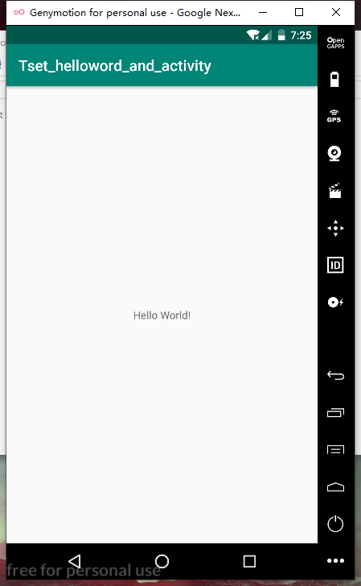
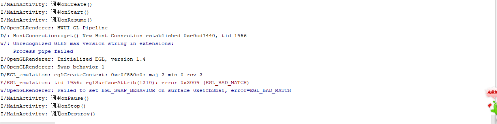

# Read Me

### 程序：Test_helloword_and_activity

#### 一、程序功能
（1）在界面中输出“hello word”。  
（2）验证activity的生命周期，输出到程序后台。  
#### 二、代码实现
```
package com.example.administrator.tset_helloword_and_activity;

import android.support.v7.app.AppCompatActivity;
import android.os.Bundle;
import android.util.Log;

public class MainActivity extends AppCompatActivity {

    @Override
    protected void onCreate(Bundle savedInstanceState) {
        super.onCreate(savedInstanceState);
        setContentView(R.layout.activity_main);
        Log.i("MainActivity","调用onCreate()");
    }

    @Override
    protected void onStart() {
        super.onStart();
        Log.i("MainActivity","调用onStart()");
    }

    @Override
    protected void onResume() {
        super.onResume();
        Log.i("MainActivity","调用onResume()");
    }

    @Override
    protected void onPause() {
        super.onPause();
        Log.i("MainActivity","调用onPause()");
    }

    @Override
    protected void onStop() {
        super.onStop();
        Log.i("MainActivity","调用onStop()");
    }

    @Override
    protected void onDestroy() {
        super.onDestroy();
        Log.i("MainActivity","调用onDestroy()");
    }

    @Override
    protected void onRestart() {
        super.onRestart();
        Log.i("MainActivity","调用onRestart()");
    }
}
```

#### 三、运行结果


